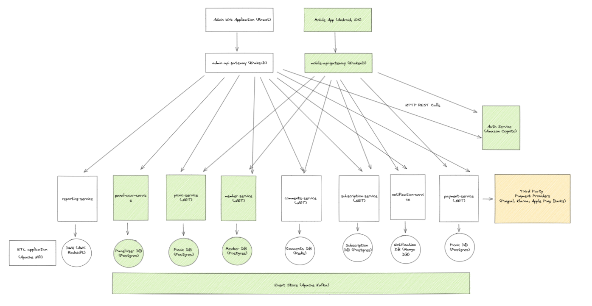
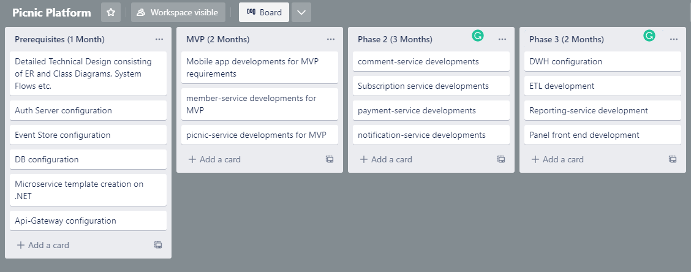
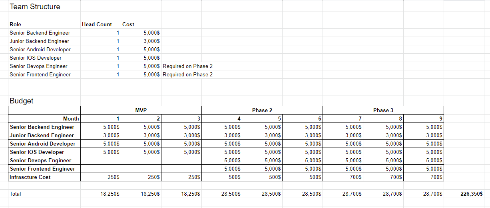

# Picnic Platform Technical Planning

##Introduction

This document is created to show the technical details about the Picnic Platform
that is going to be developed. A general architecture is given to the readers
for them to visualize what will be developed and provides a roadmap for
achieving the required product. This documents also contains HR requirements and
budgeting.

## Requirements

The Picnic Platform would have below requirements. This requirements can be
splitted up as MVP and Phase 2 for creating an agile delivery cycle.

### MVP

- All individuals should create a profile and login to the system with their
  credentials
- Members should be able to organize picnics at specific locations
- Members should be able to invite friends and family to the meetings they have
  created
- Picnics should have a collaborative list for the members to list what they
  will bring to the picnic

### Phase 2

- Members should be able to comment and tag each other on meetings
- Members may choose to pay a subscription fee for private picnics
- Members should be able to recieve notification about their picnic activities

### Phase 3

- Panel users needs to be able to access some reports or audit logs via panel

## Overall Architecture

For being able to achieve above requirements, there is an overall architecture
diagram has provided below. This is a microservice application architecture
which uses Event Sourcing pattern to coordinate data consistency between
services.

The parts with green background should be developed / configured in MVP phase of
the product.

## Technologies Used

### Cloud Environment

- Amazon Web Services as cloud provider
- Amazon Elastic Container Service for running microservices as containers
- Amazon Cognito for Identity Management and Authentication
- Amazon RDS for PostgreSQL
- Amazon Managed Streaming for Apache Kafka (MSK) for Event Store
- Amazon MemoryDB for Redis
- MongoDB Atlas for MongoDB
- Amazon Redshift for DWH reporting

### Microservices

- .NET6

### Mobile Applications

- Native IOS
- Native Android

### Admin Panel

- React

### Reporting

- Apache Nifi for ETL flow

## Roadmap

You can find a technical roadmap with estimated time costs on below.

## Team Composition

For the MVP phase of the project there needs to at lease 1 Senior and 1 Junior
.NET developers involved in the design , configuration and development processes
of the app. Because the frontend will be delivered as mobile application at
least 1 IOS and 1 Android developer should be included.

On the Phase 2, Admin panel development starts, so there should be a Front-end
developer included on this phase.

Because we released the product to the production enviroment and a support of a
Devops Engineer should be included for helping developers to focus on new
feature developments majorly.

## Budget

You can find an overall estimated budget below for this 3 phases mentioned
above. Nearly 250k$ will be needed to make this scope of the product up and
running for 9 months.

[You can access the budget document here!](https://docs.google.com/spreadsheets/d/1b-Ipr0qxdi3UDTNpE2rj1c-iUPQClobMsx6gkSr3F7o/edit?usp=sharing)
