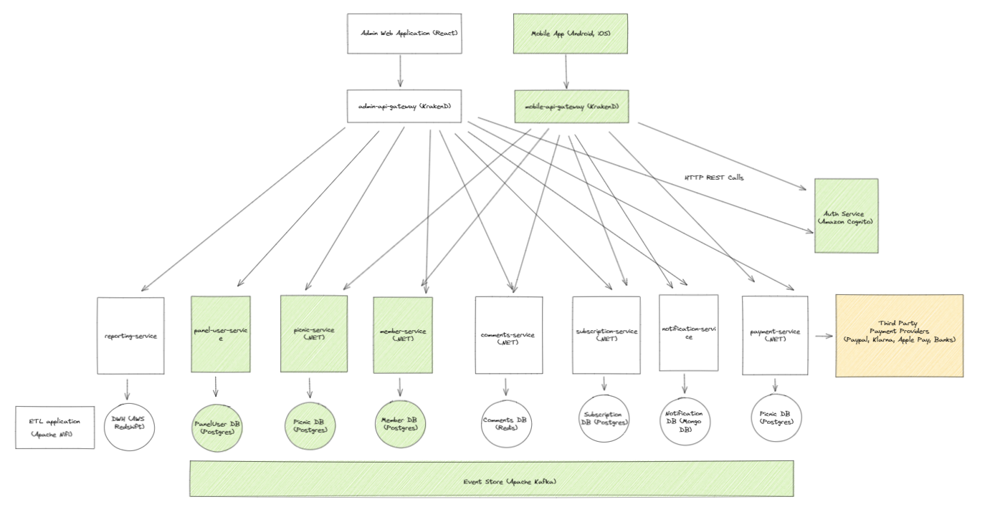

# Picnic Platform

Picnic Platform is a platfor where members of the system can create picnics and
invite their friends to them.

<pre>
You can reach the Technical Roadmap document by following <a href="Planning.md">this link</a>
</pre>

An overall architecture diagram is like below:



This code example focuses only a single `picnic-service` microservice which is
responsible for querying and inserting objects related to Picnic domain.

The Entity-relation diagram is like below:


You can do below operations with the written applications

- List all picnics
- Create a picnic
- Create a picnic invite
- List all invites of a picnic

## The Code Structure

This microservice model uses Clean Architecture principles which is inspired by
the
[Clean Architecture template of Jason Taylor](https://github.com/jasontaylordev/CleanArchitecture)

Although a PostreSQL instance was used in the architectural design, an SQL
Server is used in this code base to shorten Postgres adaptation. Though on a
real implementation, I strongly think that an open-source database should be
used for this kind of product.

## Application Setup

### Prerequisites

This application runs on .NET 6 so .NET Runtime should be installed on your
computer to run the
application.[Download Link](https://dotnet.microsoft.com/en-us/download/dotnet/6.0)

### DB Setup

We can easyly setup a MS SQL Server in our local computers with support of
Docker. If you don't have Docker on your desktop you can download
[here](https://www.docker.com/)

For downloading and creating an SQL Server Express edition with Docker, you can
execute below command in your Terminal.

```shell
docker run --name picnic-sql -e "ACCEPT_EULA=Y" -e "MSSQL_SA_PASSWORD=PicnicS@" -e "MSSQL_PID=Express" -p 1434:1433 -d mcr.microsoft.com/mssql/server:2019-latest
```

After the docker container is up and ready, we can run the below command to gain access container's bash.

```
docker exec -it picnic-sql /bin/sh
```

Then run the below command on the sh opened:
```
/opt/mssql-tools/bin/sqlcmd -S localhost -U SA -P 'PicnicS@'
```

This will bring up the mysql commandline to you. We can run the below script that would create the db and the db user.
```
CREATE DATABASE PicnicPlatform;
GO
Use PicnicPlatform;
GO

IF NOT EXISTS (SELECT * FROM sys.database_principals WHERE name = N'PicnicUser')
BEGIN
    CREATE USER PicnicUser FOR LOGIN PicnicUser
    EXEC sp_addrolemember N'db_owner', N'PicnicUser'
    EXEC master..sp_addsrvrolemember @loginame = N'PicnicUser', @rolename = N'sysadmin'
END;
GO
```

After then we can run the app with a connection to SQL Server.